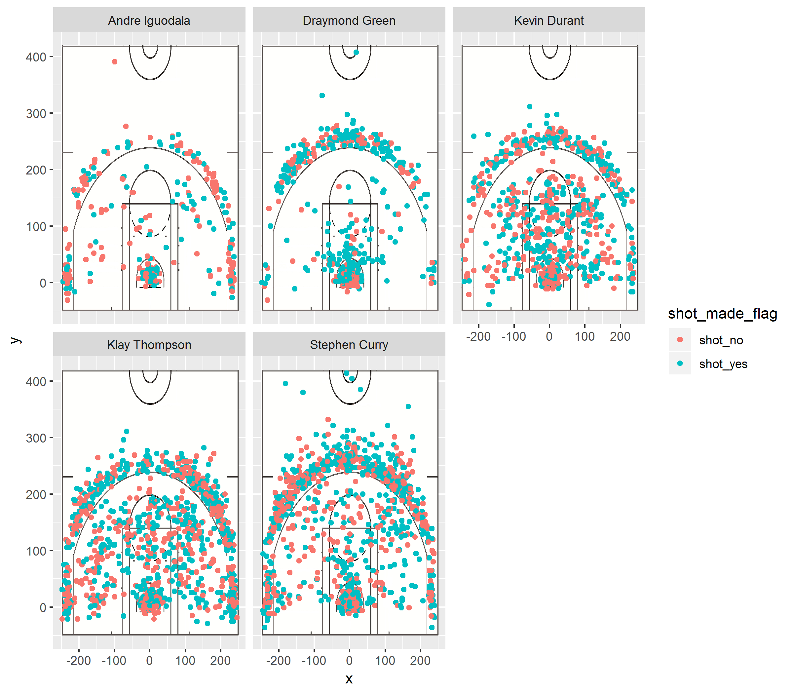
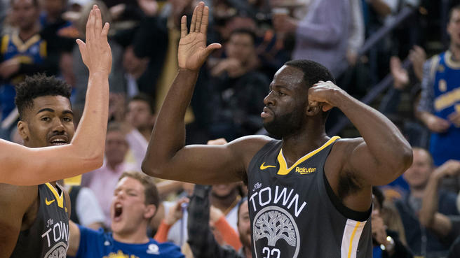

```{r setup, include=FALSE}
library(knitr)
library(dplyr)
read_chunk("../code/make-shots-data-script.R")
read_chunk("../code/make-shot-charts-script.R")
```

```{r make_shots_data, echo = FALSE, results = "hide", warning = FALSE}
```

```{r make_shot_charts, echo = FALSE, results = "hide", warning = FALSE}
```

## The question

What makes a good basketball player? There's certainly no singular answer, but everyone can agree that point-scoring ability is a major factor. But sheer number of points scored is too simple a measure: some players have had many more opportunities to shoot than others. Some players are also better at 2 point shots but less adept at 3 point shots.

In this report, we examine the effectiveness of some of the Golden State Warriors' shots during the 2016 season. We focused on all of the shots taken by Andre Iguodala, Draymond Green, Kevin Durant, Klay THompson, and Stephen Curry. The players' shots were mapped onto a court diagram and analyzed for accuracy/effectiveness.

## The data

Data for each player's shots include the type of shot (i.e. 2 or 3 points), the coordinates for where the shot was taken (measured in inches), whether the shot was successful, as well as other information not utilized in our analysis.

A preview of the raw data for Stephen Curry is included here, as are text summaries for the combined data sets.

```{r data_sum, echo = FALSE}
kable(head(curry))
kable(select(shots_data, period, minute, seconds_remaining, shot_made_flag, action_type, shot_type, x, y) %>%
  summary())
```

Jump shots are the most common type of action taken, with layups being second most common.

## The analysis

Here we have mapped out the locations where each player initiated a shot, colored by the success or failure of each shot.

```{r out.width="100%", echo = FALSE, fig.align = "center"}

```

From this chart, there's an immediate imbalance in the number of shots taken from player to player. Intuition might tell us that the players with fewer overall shots may have a higher percentage of made shots, as they had fewer opportunities to fail. Thus, it's difficult to make accurate comparisons form this visual representation. For that purpose, we calculated the effective shooting percentage of each player, displayed here for 2 PT, 3PT, and overall shots. The code for each chart is similar to the code included for 2PT shots.

#### 2PT Effective Shooting % by Player

```{r effective_shooting2}
eff_shoot_2pt <- shots_data
eff_shoot_2pt <- eff_shoot_2pt %>%
  filter(shot_type == "2PT Field Goal") %>%
  select(name, shot_made_flag) %>%
  group_by(name) %>%
  summarize(total = length(shot_made_flag), made = length(shot_made_flag[shot_made_flag == "shot_yes"]), perc_made = round(made/total, digits = 3)) %>%
  arrange(desc(perc_made))
kable(eff_shoot_2pt, caption = "2PT Effective Shooting % by Player")
```

#### 3PT Effective Shooting % by Player

```{r effective_shooting3, echo = FALSE}
eff_shoot_3pt <- shots_data
eff_shoot_3pt <- eff_shoot_3pt %>%
  filter(shot_type == "3PT Field Goal") %>%
  select(name, shot_made_flag) %>%
  group_by(name) %>%
  summarize(total = length(shot_made_flag), made = length(shot_made_flag[shot_made_flag == "shot_yes"]), perc_made = round(made/total, digits = 3)) %>%
  arrange(desc(perc_made))
kable(eff_shoot_3pt, caption = "3PT Effective Shooting % by Player")
```

#### Overall Effective Shooting % by Player

```{r effective_shooting, echo = FALSE}
eff_shoot <- shots_data
eff_shoot <- eff_shoot %>%
  select(name, shot_made_flag) %>%
  group_by(name) %>%
  summarize(total = length(shot_made_flag), made = length(shot_made_flag[shot_made_flag == "shot_yes"]), perc_made = round(made/total, digits = 3)) %>%
  arrange(desc(perc_made))
kable(eff_shoot, caption = "Overall Effective Shooting % by Player")
```

Now we see that Draymond Green has the highest shot effectiveness for 3 point shots (68.1%) and overall (57.6%), taking only second place among 2 point shots. Stephen Curry and Klay Thompson have very similar numbers of overall shots taken and effectiveness percentages, but Curry leads the two in 3 point shots while Thompson leads in 2 point shots. Andre Iguodala had the lowest percent made for 3 point shots, but the highest percent of 2 point shots. This fluctation makes sense, given the relatively low number of shots taken overall.

The average effective shooting eprcentage for all five players is:

```{r eff_shoot_avg}
kable(shots_data %>%
  summarize(total = length(shot_made_flag), made =  length(shot_made_flag[shot_made_flag == "shot_yes"]), perc_made = round(made/total, digits = 3)) %>%
  arrange(desc(perc_made)))
```

## The takeaway

Of the five players analyzed, it seems that Draymond Green is the most effective shooter overall. However, additional analysis may give more insight beyond the scope of this report. Of interest would be a look into effectiveness when grouping by the type of shot (layup, jump shot, etc.) This could reveal more insight into each player's strengths and weaknesses.

```{r out.width="100%", echo = FALSE, fig.align = "center"}

```
